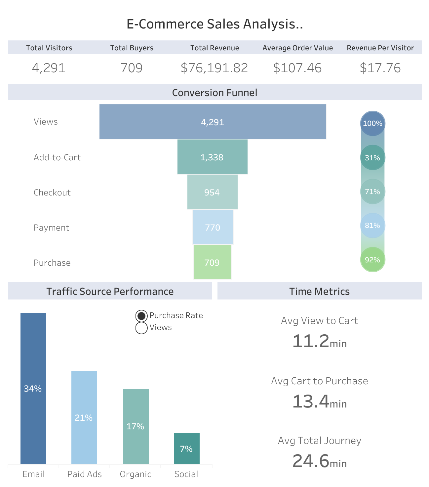

# E-Commerce Sales Analysis

## Project Overview
This project analyzes one month of customer behavior in an e-commerce platform to evaluate how effectively visitors convert into buyers. The analysis examines the full customer journey from product view to purchase, identifies conversion bottlenecks, and evaluates marketing channel performance.
The goal of the project is to uncover insights that can improve conversion rates, increase revenue, and optimize marketing investments.

## Business Questions
* Where do customers drop off in the purchase funnel?
* Which marketing channels generate the highest conversion rates?
* How long does the average customer take to complete a purchase?
* How efficiently does the platform convert traffic into revenue?

## Tools
* SQL (BigQuery)
  * Data extraction and analysis
  * Funnel analysis using conditional aggregation
  * CTEs
* Tableau
  * Dashboard visualization
  * Parameter-based metric toggle
 
## Key Metrics
* Total Visitors: 4,291
* Total Buyers: 709
* Overall Conversion Rate: 17%
* Total Revenue: $76,191
* Average Order Value: $107
* Revenue per Visitor: $17.76 
* Average Purchase Journey: 24.56 minutes

## Key Insights
1. Funnel optimization
   * Major funnel drop-off occurs before Add-to-Cart  
     &emsp;Only 31% of users add products to their cart, meaning almost 70% leave the website before showing intent of purchase
   * Checkout flow is efficient  
     &emsp;Once users add a product to their cart, the funnel converts strongly:  
     &emsp;&emsp;&emsp;Cart → Checkout: 71%  
     &emsp;&emsp;&emsp;Checkout → Payment: 81%  
     &emsp;&emsp;&emsp;Payment → Purchase: 92%
2. Marketing strategy
   * Email drives the highest quality traffic  
     &emsp;Email has a 34% conversion rate, significantly stronger than other channels, and a very high view-to-cart rate at 63% 
   * Social media is heavily underperforming  
     &emsp;Despite social media driving ~29% of traffic, it has the lowest conversion rate at only 7%
3. Time spent
   * Short customer purchase journey  
     &emsp;Average time from first product view to purchase is only ~25 minutes, suggesting more impulse purchases
4. Monetization metrics
   * Strong revenue efficiency  
     &emsp;Website generates an AOV of $107 and revenue-per-visitor of $17.76

## Business Reccomendations
1. Improve product page engagement to increase add-to-cart rates  
   * A 5% increase in the view-to-cart rate results in an additional 110 purchases, leading to an estimated $11,000+ in additional revenue over 30 days
   * Potential improvements could include product reviews, product images, and price clarity
2. Invest more in email marketing  
   * Implement cart abandonment emails, email-exclusive discounts, sign-up deals, etc.
   * Our data shows email visitors are more likely to convert
3. Reevaluate social media marketing  
   * Improve ad targeting or reallocate social media budget

## Dashboard  
[Click here to view interactive dashboard!](https://public.tableau.com/views/E-CommerceSalesAnalysis_17731650449230/Dashboard1?:language=en-US&:sid=&:redirect=auth&:display_count=n&:origin=viz_share_link)  

The Tableau dashboard contains 4 distinct visualizations:
1. KPI Summary - Table containing important sales metrics
2. Conversion Funnel - Vizualization of the funnel stages and their conversion rates
3. Traffic Source Performance - Bar graph comparing performance of a selected metric by source
4. Time Metrics -  Summary of average time spent by customers

## Dataset
The dataset contains user interaction events from an e-commerce website, found in the user_events.csv file.

